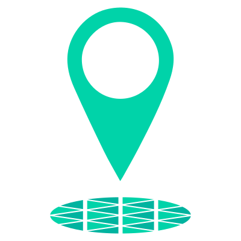
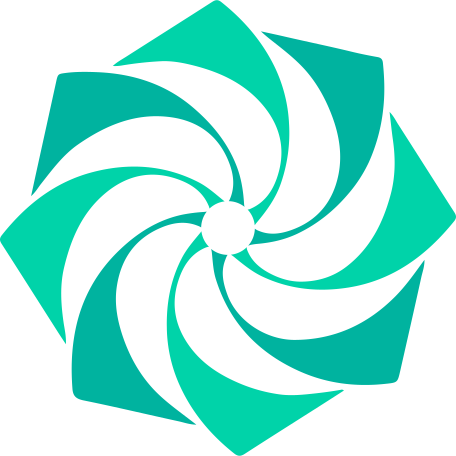
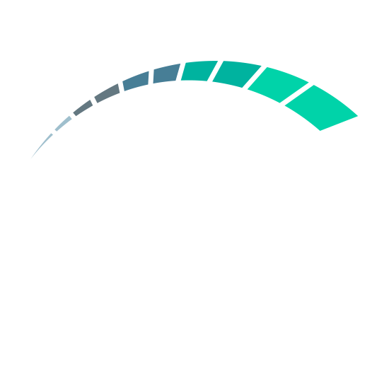
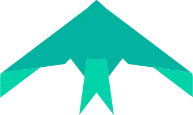
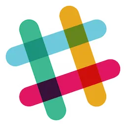
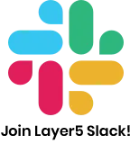

      <picture align="center">
         <source media="(prefers-color-scheme: dark)" srcset="./.github/assets/images/khulnasoft/khulnasoft-light-no-trim.svg">
         <source media="(prefers-color-scheme: light)" srcset="./.github/assets/images/khulnasoft/khulnasoft-no-trim.svg">
         
      </picture>

<h5>
<i>If you’re using KhulnaSoft products or if you like the project, please <a href="https://github.com/khulnasoft/khulnasoft/stargazers">★</a> this repository to show your support! 🤩</i>
</h5>

# About KhulnaSoft

[KhulnaSoft](https://khulnasoft.com)'s cloud native application and infrastructure management software enables engineers to expect more from their infrastructure. We embrace _developer_-defined infrastructure. We empower developers to change how they write applications, support _operators_ in rethinking how they run modern infrastructure, and enable _product owners_ to regain full-control over their product portfolio.

# Projects

<h2><a href="https://khulnasoft.com/meshplay">Meshplay</a></h2>

<a href="https://meshplay.khulnasoft.com">Meshplay</a> is the collaborative cloud native manager that enables the adoption, operation, and management of Kubernetes and its workloads.
   

 

<h2><a href="https://khulnasoft.com/meshmap">MeshMap</a></h2>

<a href="https://khulnasoft.com/meshmap">MeshMap</a> is an end-to-end management platform, here to help teams understand problems, deploy designs, apply patterns, manage and operate your deployments and services in real-time.
   

 

<h2><a href="https://github.com/service-mesh-patterns">Cloud Native Patterns</a></h2>

<a href="https://github.com/service-mesh-patterns">Cloud Native Patterns</a> help you get the most out of Kubernetes and every CNCF project. Each pattern can be used as a template and is customizable.
   

 

<h2><a href="https://khulnasoft.com/landscape">Service Mesh Landscape</a></h2>

The <a href="https://khulnasoft.com/landscape">Service Mesh Landscape</a> is a comprehensive collection of prominent service mesh projects and offerings laid out in contrast to one another.
   

 

<h2><a href="https://khulnasoft.com/projects/cloud-native-performance">Cloud Native Performance</a></h2>
<a href="https://khulnasoft.com/projects/cloud-native-performance">
<picture align="left">
         <source media="(prefers-color-scheme: dark)" srcset="src/assets/images/service-mesh-performance/stacked/smp-light-text.svg">
         <source media="(prefers-color-scheme: light)" srcset=".github/assets/images/smp-dark-text.svg">
         
</picture>
</a>
The <a href="https://khulnasoft.com/projects/cloud-native-performance">Cloud Native Performance</a> is a vendor-neutral specification for capturing details of environment and infrastructure details, cloud native infrastructure and its configuration, service/application details, and bundling of statistical analysis of results.
   

 

<h2><a href="https://khulnasoft.com/projects/image-hub">Image Hub</a></h2>

<a href="https://khulnasoft.com/projects/image-hub">Image Hub</a> is a demo application which runs on <a href="https://docs.meshplay.khulnasoft.com/service-meshes/adapters/consul">Consul</a> and facilitates exploring WebAssembly modules used as Envoy Filters.
Image Hub supports Envoy-based data planes. It is compatible with and can be deployed on Istio and Consul service meshes.
   

 

 <h2><a href="https://github.com/meshplay/meshplay-operator">Meshplay Operator</a></h2>
 
 <a href="https://github.com/khulnasoft/meshplay-operator"> Meshplay Operator</a> deploys and manages MeshSync.
     

 

<h2><a href="https://github.com/khulnasoft/learn-khulnasoft">Learn KhulnaSoft</a></h2>

<a href="https://github.com/khulnasoft/learn-khulnasoft">Learn KhulnaSoft</a> is a sample application for learning how cloud native infrastructure works.
   

 

<!-- 

<h2><a href="https://khulnasoft.com/smi">Service Mesh Interface Conformance </a></h2>

<a href="https://khulnasoft.com/smi">SMI Conformance</a> includes all service mesh projects participating in the Service Mesh Interface specification. It is an easy-to-use, service mesh and SMI-specific tool to give service mesh projects and users a suite of repeatable conformance tests.
   

 
 -->

<h2><a href="https://khulnasoft.com/projects/nighthawk">Nighthawk</a></h2>

<a href="https://getnighthawk.dev/">Nighthawk</a> is a Layer 7 (HTTP/HTTPS/HTTP2) performance characterization tool. Nighthawk is Envoy’s load generator and is written in C++. Meshplay integrates Nighthawk as one of (currently) three choices of load generator for characterizing and managing the performance of infrastructure and services.
   

<h2><a href="https://meshplay.khulnasoft.com/catalog">Meshplay Catalog</a></h2>

<a href="">Meshplay Catalog</a> As a central hub for sharing cloud native infrastructure designs, Meshplay Catalog enables the exchange of the best practices, reusable templates, and Kubernetes-based operational patterns for multi-cluster Kubernetes clusters and distributed applications. Meshplay Catalog serves as a marketplace full of curated cloud native infrastructure configurations and operational patterns perfect for DevOps engineers who seek to leverage and contribute to Meshplay's large collection of design patterns.
   

<h1> <a href="https://khulnasoft.com/community">Community</a> and <a href="https://khulnasoft.com/community/handbook">Contributions</a></h1>

 We warmly welcome all contributors! Our projects are community-built and each welcomes open collaboration. As you get started, please review this project's <a href="https://github.com/khulnasoft/khulnasoft/blob/master/CONTRIBUTING.md">contributing guidelines</a>. Whether you are a user or code contributor and whether you're opening an <a href="/../../issues">issue</a> or a <a href="/../../pulls">pull request</a>, know that any form of your engagement is considered contribution and is appreciated. Contributors are expected to adhere to the <a href="https://github.com/cncf/foundation/blob/master/code-of-conduct.md">CNCF Code of Conduct</a>.

  Join us in the <a href="https://discuss.khulnasoft.com">discussion forum</a> and on <a href="https://slack.khulnasoft.com"> Slack</a> to learn more about KhulnaSoft and its community! Make sure you see the <a href="https://khulnasoft.com/community/newcomers">newcomer's guide</a> for a tour of resources available to you.

<a href="https://slack.meshplay.khulnasoft.com">

<picture align="right">
  <source media="(prefers-color-scheme: dark)" srcset=".github/assets/images/buttons/slack-dark-128.webp"  width="110px" align="right" style="margin-left:10px;margin-top:10px;">
  <source media="(prefers-color-scheme: light)" srcset=".github/assets/images/buttons/slack-128.webp" width="110px" align="right" style="margin-left:10px;padding-top:5px;">
  
</picture>
</a>

✔️ <em><strong>Join</strong></em> any or all of the weekly meetings on the <a href="https://meet.khulnasoft.com">community calendar</a>. 
✔️ <em><strong>Watch</strong></em> community <a href="http://youtube.com/KhulnaSoft?sub_confirmation=1">meeting recordings</a>. 
✔️ <em>Fill-in</em> a <a href="https://khulnasoft.com/newcomers">community member form</a> to gain access to community resources.
 
✔️ <em><strong>Discuss</strong></em> in the <a href="https://discuss.khulnasoft.com">Community Forum</a>. 
✔️ <em><strong>Explore more</strong></em> in the <a href="https://khulnasoft.com/community/handbook">Community Handbook</a>. 

<i>Not sure where to start?</i> Grab an open issue with the <a href="https://github.com/issues?q=is%3Aopen+is%3Aissue+archived%3Afalse+org%3Akhulnasoft+org%3Ameshplay+org%3Aservice-mesh-performance+org%3Aservice-mesh-patterns+org%3Akhulnasoft+label%3A%22help+wanted%22+">help-wanted label</a>.

 
<ul>
  <li>Find us on Twitter: <a href="https://twitter.com/khulnasoft">@khulnasoft</a>, <a href="https://twitter.com/meshplayio">@meshplayio</a>, and <a href="https://twitter.com/smp_spec">@smp_spec</a>.</li>
  <li>Visit us on LinkedIn: <a href="https://www.linkedin.com/company/khulnasoft">KhulnaSoft</a>, <a href="https://www.linkedin.com/showcase/meshplay/">Meshplay</a>, and <a href="https://www.linkedin.com/showcase/service-mesh-performance">Cloud Native Performance</a>.</li>
  <li>Subscribe on <a href="http://youtube.com/KhulnaSoft?sub_confirmation=1">Youtube</a>.</li>
</ul>

### License

All of KhulnaSoft's projects are available as open source under the terms of the [Apache 2.0 License](https://opensource.org/licenses/Apache-2.0).

